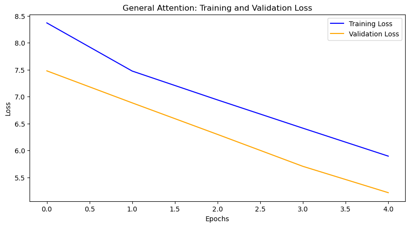
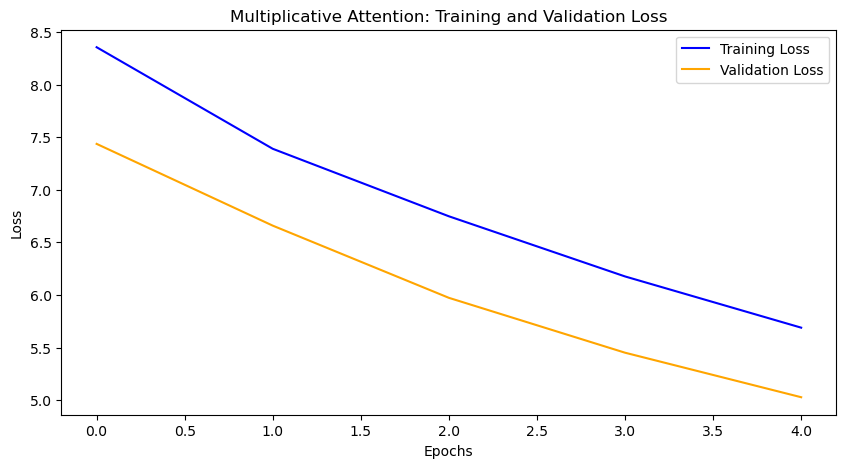

# A3: Make Your Own Machine Translation

This repository contains the implementation of a simple **English to Nepali machine translation web application**, developed as part of **Assignment 3 (A3)**. The application demonstrates how a Transformer-based sequence-to-sequence model with attention can be integrated into an interactive user interface.

---

## Overview

For this assignment, the web interface is built using **Dash**. The **entire UI logic and model integration** are implemented within the `app.py` file. The interface is intentionally kept simple and intuitive, consisting of:

* A text input field for the user query (English sentence)
* A **Translate** button
* Basic input validation
* A section to display the translated Nepali output

A visual demonstration of the interface is provided as a GIF.

---
## Observations

### Observations During Training and Validation

| Attention Type | Training Loss | Training PPL | Validation Loss | Validation PPL |
| -------------- | ------------- | ------------ | --------------- | -------------- |
| General        | 7.111         | 1225.625     | 6.568           | 712.002        |
| Multiplicative | 6.839         | 933.637      | 6.216           | 500.941        |
| Additive       | 6.860         | 953.436      | 6.254           | 520.322        |

From the results above, **General Attention** exhibits the highest training and validation loss as well as perplexity. Both **Multiplicative** and **Additive Attention** perform noticeably better during training, with training losses of 6.839 and 6.860 respectively.

Multiplicative attention achieves the **lowest validation loss (6.216)** and **lowest validation perplexity (500.941)**, while additive attention closely follows with a validation loss of 6.254 and validation perplexity of 520.322.

Overall, all three attention variants show improvements in loss and perplexity during validation, indicating reasonable generalization to unseen data.

---

### Observations During Testing

| Attention Type | Testing Loss | Testing PPL | Model Size (MB) | Inference Time (s) | Avg. Time per Epoch (s) |
| -------------- | ------------ | ----------- | --------------- | ------------------ | ----------------------- |
| General        | 6.568        | 712.002     | 52.69           | 0.030              | 181.176                 |
| Multiplicative | 6.216        | 500.941     | 52.69           | 0.016              | 185.551                 |
| Additive       | 0.390        | 1.477       | 52.69           | 0.025              | 202.331                 |

All three models have an identical size of **52.69 MB**. In terms of computational efficiency during training, the **General Attention** model has the lowest average epoch time (181.176s), followed by **Multiplicative Attention** (185.551s), and **Additive Attention** (202.331s).

During inference, all three models exhibit low latency. Among them, **Multiplicative Attention** achieves the fastest inference time, making it suitable for quicker predictions during translation tasks.

---

## 💻 CPU Deployment Note

The models used in this project were **trained on a GPU**. If the application is run on a **CPU-only environment**, the original GPU-trained checkpoints may cause runtime issues.

To address this, a utility script is provided:

* **`convert_checkpoint.py`**

This script converts GPU-trained checkpoints into **CPU-compatible checkpoints**. It should be executed before running `app.py` when deploying the application on a CPU-only machine.

---
## Performace Graphs

### Additive Attention

### General Attention

### Multiplicative Attention

---
## Demo

The demo video is available here:

