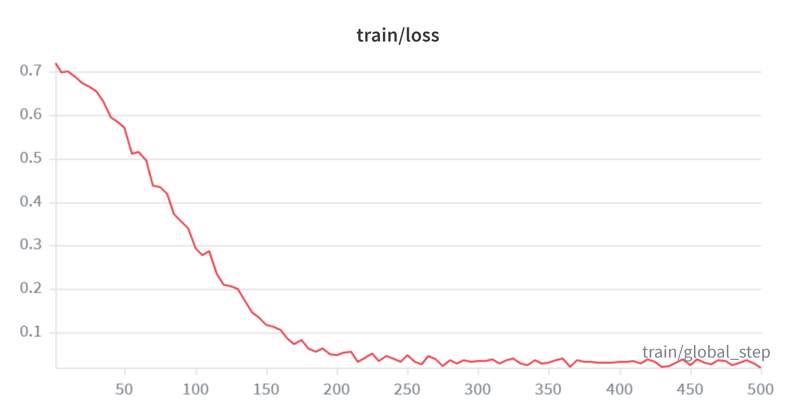
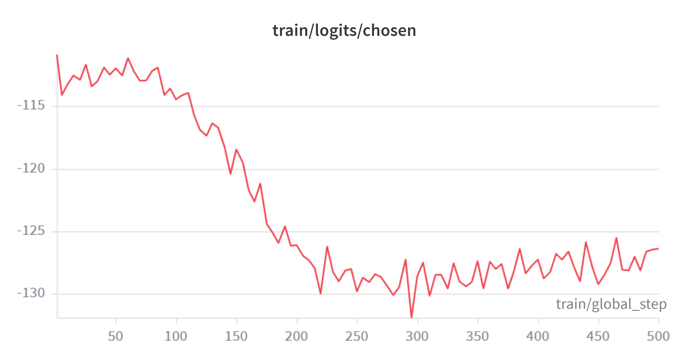
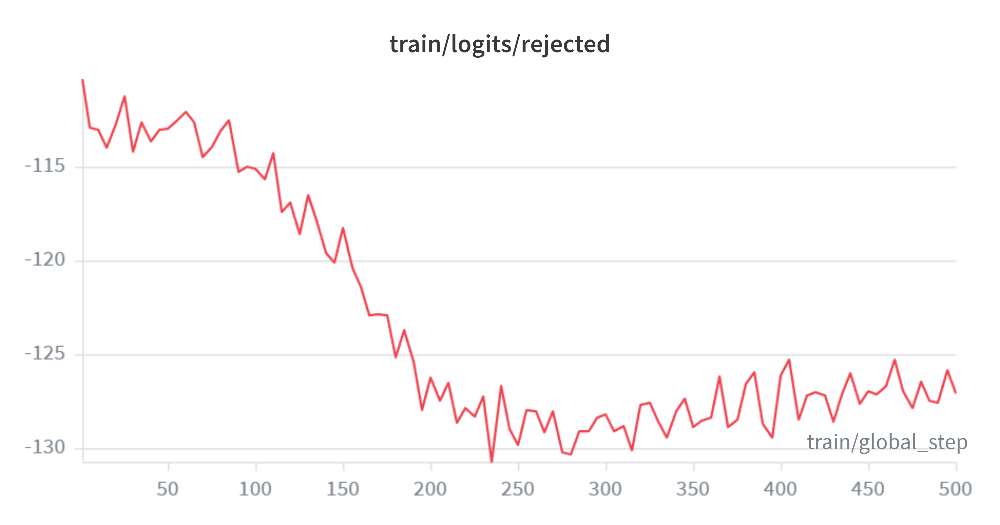
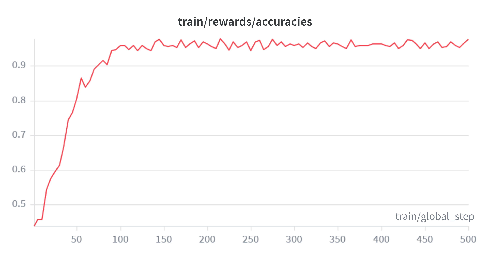

## Direct Preference Optimization (DPO)

Direct Preference Optimization (DPO) is a technique used to fine-tune language models using preference data. It allows the model to learn from human feedback without requiring a reinforcement learning (RL) pipeline.

Unlike traditional Reinforcement Learning with Human Feedback (RLHF), which requires training a reward model and performing complex policy optimization steps (such as Proximal Policy Optimization, PPO), DPO directly optimizes the model based on comparisons between preferred and rejected responses. The model is trained to increase the likelihood of preferred responses while decreasing the likelihood of rejected ones.

### Why Use DPO?

DPO provides several advantages compared to traditional RLHF approaches:

- **Simpler Training**  
  Eliminates the need for reinforcement learning components such as reward models or PPO optimization.

- **More Stable Optimization**  
  Avoids many of the instability issues that can arise in RL-based training methods.

- **Better Alignment**  
  Encourages models to align more closely with human preferences through direct optimization.

- **Computational Efficiency**  
  Requires fewer computational resources compared to RLHF pipelines.

---

## Dataset

This project uses the **Anthropic HH-RLHF dataset**, which is publicly available on Hugging Face.  
The dataset contains pairs of model responses where one response is preferred over the other based on human feedback. These preference pairs are used to train the model using the DPO objective.

Dataset link:  
https://huggingface.co/datasets/Anthropic/hh-rlhf

## Model - Hugging Face Repo

Hugging Face Repo Link: https://huggingface.co/cass-afk/a5/tree/main

---

## Training Results

The model was fine-tuned using the DPO training objective. During training, the loss decreased steadily as the model learned to prefer higher-quality responses over rejected ones.

### Training Loss

### Logits Chosen

### Logits Rejected

### Reward Accuracies

---

## Evaluation

As the assignment instructs, we compare our baselne and our fine tuned DPO model. For this experiment, we use gemini-flash-2.5 model to judge our responses.

| Sample ID | Instruction                                                         | Winner   |
|-----------|---------------------------------------------------------------------|----------|
| 1 | What are some good browser alternatives to Chrome? | Model A |
| 2 | Hi, my sister and her girlfriends want me to play kickball w... | Model A |
| 3 | Hi, I have some falafel, but no tahini to put on them. Can y... | Tie |
| 4 | Can you tell me how to make chocolate chip cookies? | Tie |
| 5 | How can I make bubble solution? | Tie |
| 6 | How is oil turned into gasoline? | Tie |
| 7 | How do I wrap a present neatly? | Tie |
| 8 | What is some cool music from the 1920s? | Model A |
| 9 | Hi, I'd like to play ice hockey. Can you explain how the gam... | Model B |
| 10 | Is the US border open to Canada? | Model A |
| 11 | What are the names of some famous actors that started their... | Tie |
| 12 | Hi, I've decided to keep a rat as a pet. How do I house, fee... | Model B |
| 13 | I have my grandfather's antique fountain pen and a bottle of... | Model A |
| 14 | What breed dog is smallest? | Tie |
| 15 | What is kevlar made out of? | Tie |

---
## Win Rate Calculation

The win rate for the DPO model is calculated using the AlpacaEval scoring formula:

\[
Win\ Rate = \frac{Wins_B + 0.5 \times Ties}{Total\ Comparisons} \times 100
\]

Where:

- **Wins_B** = Number of times the DPO model (Model B) wins
- **Ties** = Number of comparisons judged as ties
- **Total Comparisons** = Total number of evaluation samples

From the evaluation results:

- Model B Wins = **2**
- Ties = **8**
- Total Samples = **15**

### Calculation

\[
Win\ Rate = \frac{2 + 0.5 \times 8}{15} \times 100
\]

\[
Win\ Rate = \frac{2 + 4}{15} \times 100
\]

\[
Win\ Rate = \frac{6}{15} \times 100
\]

\[
Win\ Rate = 40\%
\]

### Final Result

**DPO Model Win Rate: 40%**

Since the win rate is below **50%**, the DPO model did not outperform the base model on this AlpacaEval sample. However, the high number of ties (8 out of 15) suggests that both models often produced responses of comparable quality.

---
## Demo
You can run the web application by running app.py on your localhost.
