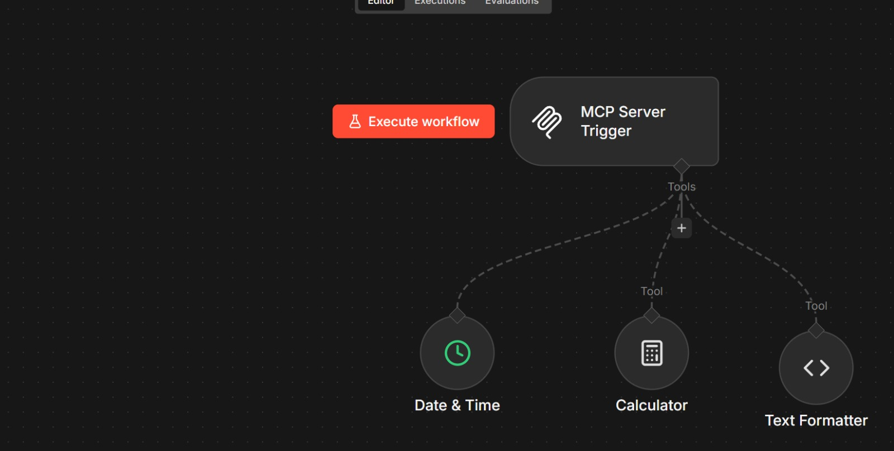
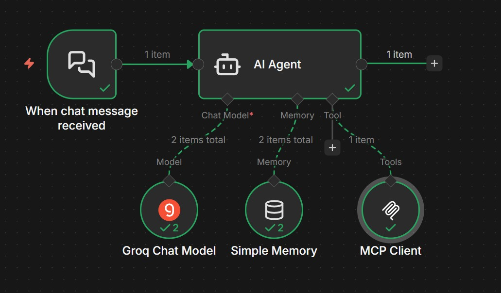
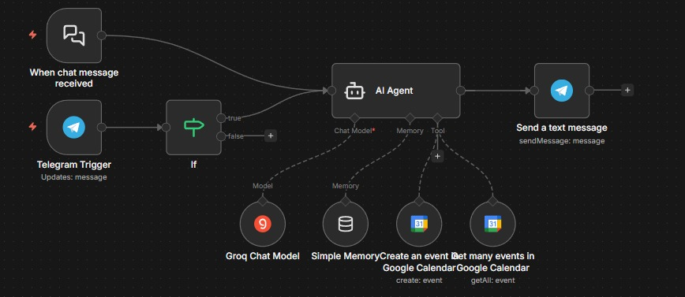
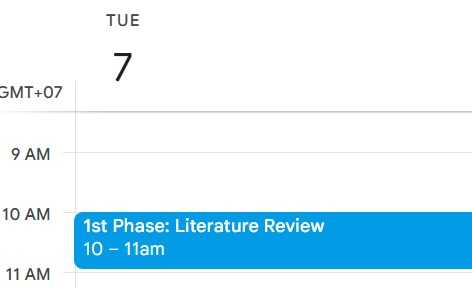
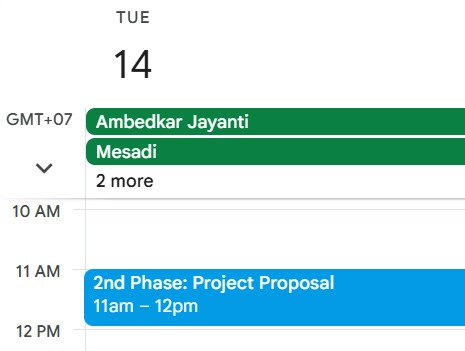
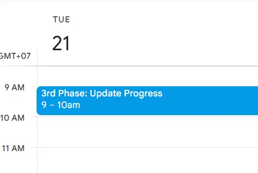
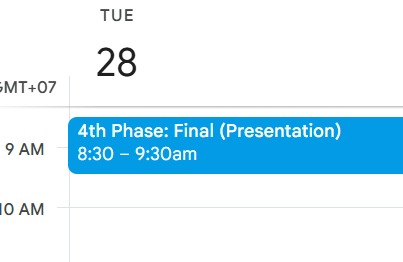
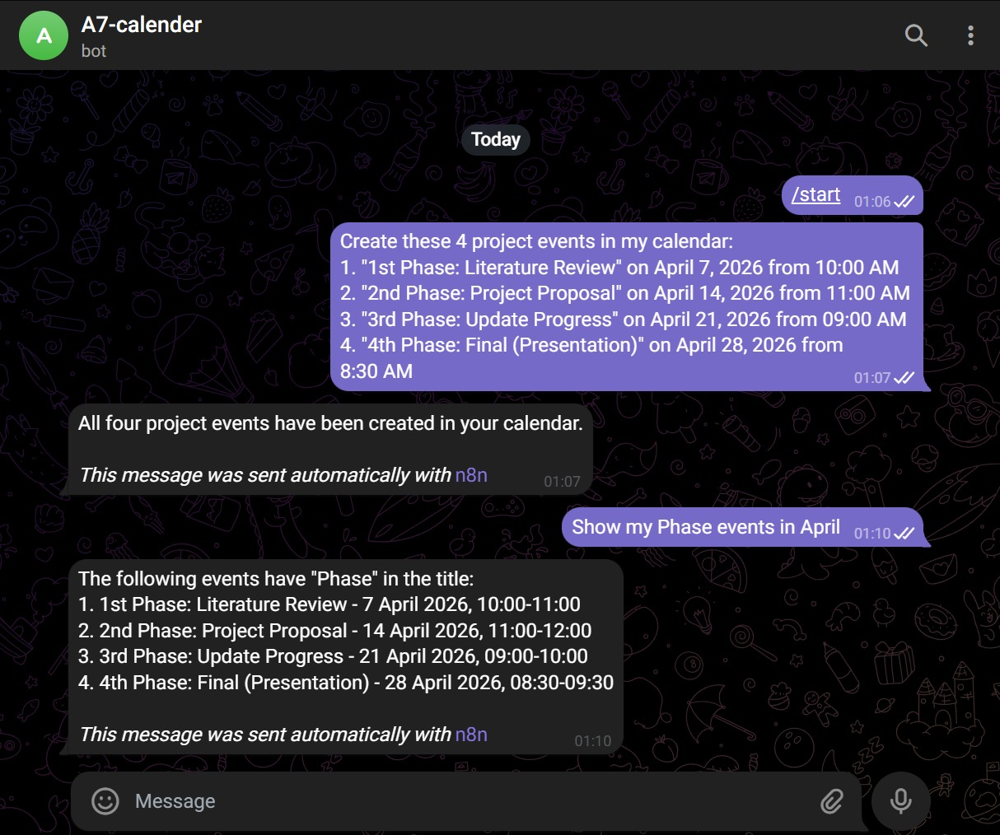

# A7: MCP-Server, AI Agent, and External Tool Integration

## Overview
This project demonstrates an integrated AI Agent ecosystem using the Model Context Protocol (MCP). The agent can manage real-world schedules and communicate via Telegram, showcasing practical Natural Language Understanding (NLU).

---

## Prerequisites

- Docker & Docker Compose
- ngrok account (free tier)
- Groq API key
- Telegram account
- Google Cloud account (for Calendar API)

---

## Setup Instructions

### 1. Environment Setup

Create a `.env` file:

```env
DB_USER=n8n_admin
DB_PASSWORD=your_secure_password
DB_NAME=n8n_db
NGROK_URL=https://your-domain.ngrok-free.app
```

### 2. Start Docker

```bash
docker compose up -d
```

### 3. Start ngrok

```bash
ngrok http 5678 --domain=your-domain.ngrok-free.app
```

### 4. Access n8n

- Local: http://localhost:5678
- Public: https://your-domain.ngrok-free.app

---

## Task 1: MCP Infrastructure & Server Setup 

### 1.1 Server Deployment 
- n8n deployed locally using Docker
- Exposed to internet using ngrok
- Production URL accessible for webhooks

**Screenshot - n8n Running:**


---

### 1.2 MCP Server Workflow
Created an n8n workflow acting as MCP Server with:
- MCP Server Trigger
- Three internal tools:
  - **Calculator** - performs basic math operations
  - **Date & Time** - provides current date/time information
  - **Text Formatter** - formats text (uppercase, lowercase, etc.)

**Screenshot - MCP Server Workflow with Tools:**



---

### 1.3 AI Agent Client
Created AI Agent workflow with:
- **Chat Trigger** - receives messages
- **Groq Chat Model** - LLM for processing (llama-3.1-8b-instant)
- **Simple Memory** - maintains conversation context
- **MCP Client** - connects to MCP Server

**MCP Client Configuration:**
- Endpoint: `http://localhost:5678/mcp/a7-mcp-server`

**Screenshot - AI Agent Workflow:**



---

## Task 2: Telegram & Google Calendar Integration

### 2.1 Telegram Bot API 
- Created Telegram bot via @BotFather
- Connected AI Agent to Telegram Trigger
- Agent receives and replies to messages

**Screenshot - Telegram Bot Setup:**



---

### 2.2 Google Calendar Tool 
Integrated Google Calendar with capabilities:
- **Create** events
- **Read/Get** events

**Google Calendar Tool Configuration:**
- OAuth2 credentials from Google Cloud Console
- Calendar API enabled

---

### 2.3 Automated Project Scheduling 
Created 4 project phase events via Telegram command:

| Phase | Event Name | Date | Time |
|-------|------------|------|------|
| 1st | Literature Review | April 7, 2026 | 10:00 AM - 11:00 AM |
| 2nd | Project Proposal | April 14, 2026 | 11:00 AM - 12:00 PM |
| 3rd | Update Progress | April 21, 2026 | 9:00 AM - 10:00 AM |
| 4th | Final (Presentation) | April 28, 2026 | 8:30 AM - 9:30 AM |

**Prompt Used:**
```
Create these 4 project events in my calendar:
1. "1st Phase: Literature Review" on April 7, 2026 from 10:00 AM
2. "2nd Phase: Project Proposal" on April 14, 2026 from 11:00 AM
3. "3rd Phase: Update Progress" on April 21, 2026 from 09:00 AM
4. "4th Phase: Final (Presentation)" on April 28, 2026 from 8:30 AM
```


### 2.4 Interaction Verification 

**Verification Prompt:**
```
Show my Phase events in April 2026
```

**Screenshot - Google Calendar with 4 Project Phases:**





---


## Telegram Chatbot Interaction


---
## Workflow Architecture

### MCP Server Workflow
```
MCP Server Trigger
       │
       ├── Calculator (Tool)
       ├── Date & Time (Tool)
       └── Text Formatter (Tool)
```

### AI Agent Workflow
```
Telegram Trigger → IF (filter /start) → AI Agent → Send a text message
                                            │
                                            ├── Groq Chat Model
                                            ├── Google Calendar (Create)
                                            └── Google Calendar (Get Many)
```

---

## Configuration Details

### System Message (AI Agent)
```
Calendar assistant. Timezone: +07:00. Default 1 hour duration. 

Only create events when user explicitly asks to CREATE or ADD an event.
For "project phases" queries, filter events with "Phase" in title.
Never create events for greetings or /start commands.
```

### Google Calendar Tool - Create Event
- Start: `{{ $fromAI('start', 'Event start time in ISO format') }}`
- End: `{{ $fromAI('end', 'Event end time in ISO format') }}`
- Summary: `{{ $fromAI('summary', 'Event title') }}`

### Google Calendar Tool - Get Events
- After: `{{ $fromAI('after', 'Start date in ISO format') }}`
- Before: `{{ $fromAI('before', 'End date in ISO format') }}`

---

## Troubleshooting

### Token Limit Issues
- Use smaller models like `llama-3.1-8b-instant` or `groq/compound-mini`
- Shorten system message

---
